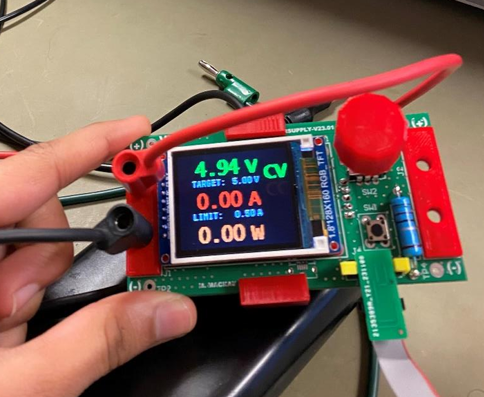
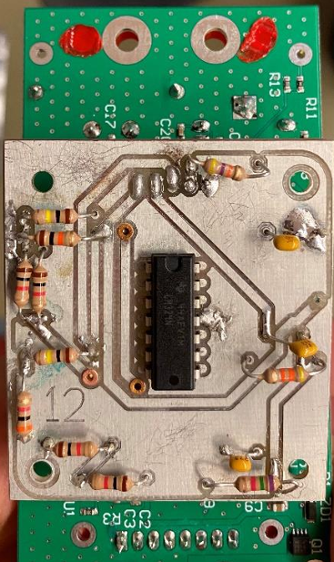
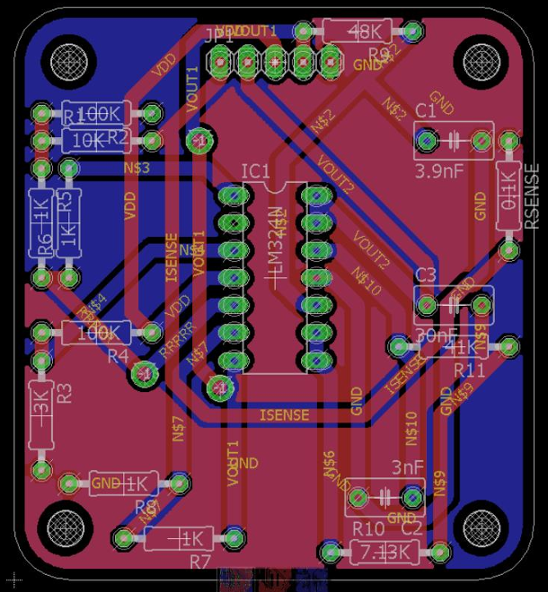

# Current Sensing for Adjustable DC Power Supply

A current-sense front end and calibrated firmware integration for an adjustable
DC power supply, built for MIE366 (Design & Analysis). The system maps
0–3.5 A of load current onto a filtered 0.25–3.3 V signal for the STM32 ADC,
with a real-time LCD/rotary-encoder interface for setting voltage/current
targets and monitoring output.

<p align="center">
  
  
</p>

## What this project covers

- **Analog design (PSpice):** low-side current sense amplifier using a
  non-inverting summing topology with an op-amp buffer/offset stage, mapping
  0–3.5 A load current to a 0.25–3.3 V output range for the STM32 ADC. A
  3rd-order 5 kHz low-pass filter (35 dB attenuation) rejects switching-regulator
  noise and prevents ADC aliasing.
- **PCB (EAGLE):** the analog schematic translated into a custom 2-layer
  current-sense daughter board (layout, Gerbers, BOM) — ground pour, short
  high-current traces, and component keepout regions — soldered and mounted
  onto the base power-supply board.
- **Firmware (STM32G051):** ADC calibration mapping load current to a
  measured value (R² = 0.999), a real-time voltage/current control loop, and
  a rotary-encoder + LCD UI for setting/displaying targets.
- **Validation:** oscilloscope measurements of filtered vs. unfiltered
  outputs under step-load conditions, confirming −35 dB attenuation at 5 kHz
  and ≤250 mV output noise; diagnosed ground-related ripple near the cutoff
  frequency and documented simulated-vs-measured discrepancies.

<p align="center">
  
</p>

## Repository contents

```
images/                        Board photos and EAGLE layout screenshot
MIE366 DA 2024 Firmware v1.0/  STM32CubeIDE project (firmware)
  Core/Inc/analogSystemConstants.h   ADC/DAC calibration constants, PID gains
  Core/Src/stm32g0xx_it.c            Control-loop ISR (ADC averaging, current
                                      calibration, CV/CC PID control, DAC update)
  Core/Src/main.c                    Display modes, UI state machine, target
                                      editing via rotary encoder
  Core/Src/ST7735.c, GFX_FUNCTIONS.c,
  Core/Inc/fonts.h                   Third-party ST7735 TFT display driver (see Credits)
  Drivers/                           STM32G0xx HAL/CMSIS (ST, own license included)
```

## Building the firmware

The firmware targets an **STM32G051G6U** and is built with **STM32CubeIDE**.

1. Open STM32CubeIDE and `File > Open Projects from File System`, pointing at
   `MIE366 DA 2024 Firmware v1.0/`.
2. Build (`Project > Build All`) and flash over SWD.
3. The `.ioc` file can be reopened in CubeMX/CubeIDE if peripheral
   configuration needs to change.

Calibration constants in `analogSystemConstants.h`
(`ADC_VOUT_CAL_*`, `ADC_ISENSE_CAL_*`, `DAC_CAL_*`) were fit to this specific
board and will need to be re-derived for any other unit.

## Credits

The base adjustable power-supply board and its original firmware
(control-loop structure, LCD/encoder UI framework) were provided as course
hardware for MIE366 (board silkscreened "M. MACKAY", rev `SUPPLY-V23.01`). I
designed and validated the current-sense amplifier circuit in PSpice, laid
out the matching EAGLE daughter board, and integrated it with the existing
STM32G051 firmware — adding the current-sense ADC channels, deriving the
calibration mapping, and updating the control loop and display for current
sensing/limiting.

The ST7735 TFT display driver (`ST7735.c`/`.h`, `GFX_FUNCTIONS.c`/`.h`,
`fonts.c`/`.h`) is a third-party library adapted into this project and is not
original work; it's included as-is for the firmware to build. The
STM32G0xx HAL and CMSIS sources under `Drivers/` are STMicroelectronics
components distributed under their own license (see `LICENSE.txt` files in
those directories).

## License

Original work in this repository (current-sense circuit design, PCB layout,
calibration/analysis, and my modifications to the firmware) is licensed under
the MIT License — see [LICENSE](LICENSE). Course-provided base firmware, the
third-party ST7735 display driver, and ST's HAL/CMSIS sources retain their
original ownership/license terms as noted above.
